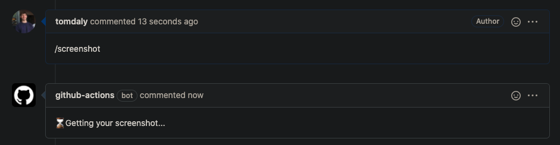
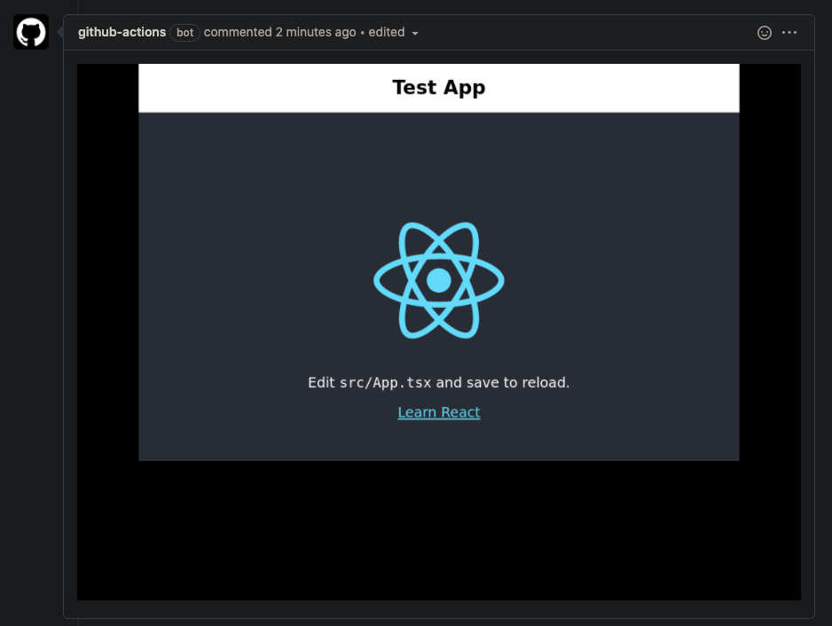
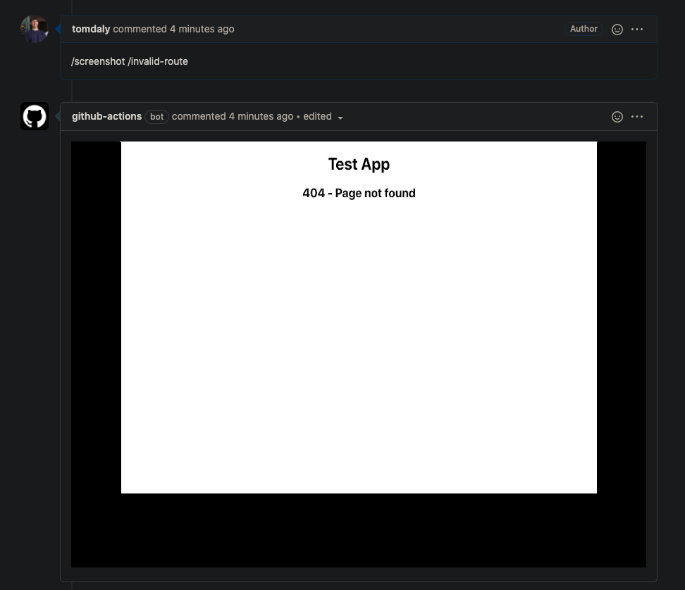

## github-action-screenshot-comment

A GitHub action to watch issue comments for the phrase `/screenshot <optional-route>`, run a CI build that takes a screenshot using Cypress, uploads it to S3, then adds the screenshot to the comment by updating it

### Example usage:

---

This repo started using the [hello-github-actions](https://lab.github.com/githubtraining/github-actions:-hello-world) repo

